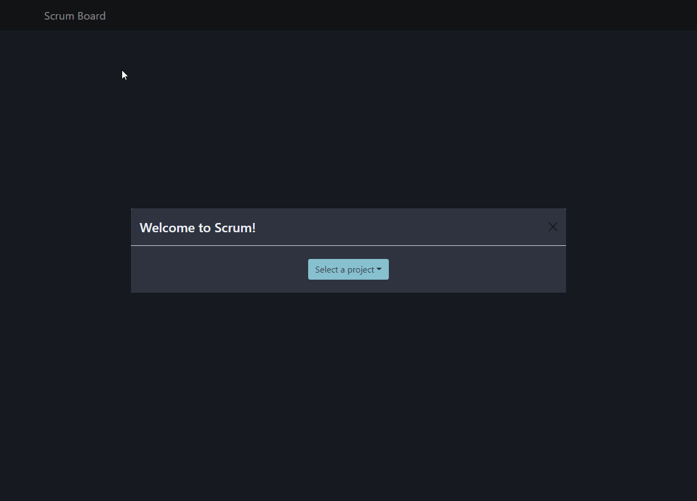

# **Scrumban Server**

## 📖 **_Description_**

This is a React application that allows a user to manage scrum/kanban tasks for a project. The user may edit the details of a task (description, due date, assigned implementer, etc), delete a task or create a new task.

## 🖥️ **_Install_**

**Note: This application is intended for use with the associated [Ruby server](https://github.com/NicMortelliti/scrumban-server).**

1. Clone the repository

```bash
git clone git@github.com:NicMortelliti/scrumban-client.git client

cd client
```

2. Use the package manager [npm](https://www.npmjs.com/) to install the dependencies.

```properties
npm install --legacy-peer-deps
```

---

## 👟 **_Run_**

Start the server.

```properties
npm start
```

The server should now be running on `localhost:3000`.

---

## 🙃 **_Usage_**



### **Selecting a project**

Selecting a project can be done two ways:

1. Upon initial page load, you are presented with a modal instructing the you to select a project from a drop down button.

2. You may change the current project by selecting the desired project from the drop down menu in the navigation bar.

### **Editing a task**

1. Click the **Edit** button on the task card.

2. In the form pop-up, Modify any of the fields displayed in the form.

3. When finished with your modifications, click **Submit**.

4. If you would like to close the form without making changes to the task, you may click the **Cancel** button, press **Esc** on your keyboard, or click off of the form.

### **Deleting a task**

1. Click the **Edit** button on the task card.

2. Click the **Delete** button.

3. If you would like to close the form without deleting the task, you may click the **Cancel** button, press **Esc** on your keyboard, or click off of the form.

### **Creating a task**

1. Click the **Create** button located in the center of the navigation bar.

2. Fill in the required task details (required tasks are indicated with an asterisk "\*")

3. When finished, click **Submit**.

---

## **_License_**

[MIT](https://choosealicense.com/licenses/mit/)
